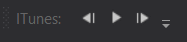

# ITunesControl_for_VS
Данный плагин представляет собой расширение для Visual Studio, позволяющее управлять плеером
Itunes из IDE.

Обязательно иметь установленный ITunes!
## Как активировать
После установки расширения добавьте новый Toolbar:
```
Правая кнопка мыши на Toolbar'ах -> Itunes Control Toolbar by PK
```


## Как использовать
Все очень просто: тулбар на данный момент представлен всего тремя кнопками:

- Предыдущий трек
- Пауза / Продолжить воспроизведение
- Следующий трек

При закрытом ITunes нажатие на любую из них автоматически запустит
экземпляр приложения.

В основе работы приложения лежит официальное SDK "ITunes COM SDK".

Функционал будет расширяться по необходимости.